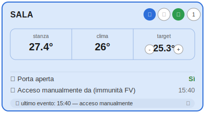
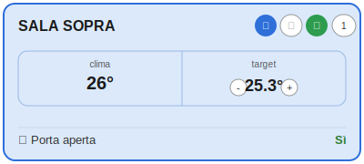

# 🌡️ Termostato Intelligente FV

**Termostato Intelligente FV** è una custom integration per Home Assistant che trasforma qualsiasi climatizzatore in un termostato smart, con gestione automatica basata su fotovoltaico, modalità notturna, deumidificazione intelligente, protezione da sonde di temperatura inaffidabili e notifiche contestuali via Google Home e Telegram.

Sviluppata e mantenuta da [UlfgarIlFabbro](https://github.com/UlfgarIlFabbro).

---

## ✨ Caratteristiche principali

- **Tre modalità di configurazione**: Semplificato, Semplificato con Fotovoltaico, Completo
- **Gestione fotovoltaico**: accensione e spegnimento automatico basati su surplus energetico, con sliding window anti-oscillazione e coordinamento a priorità tra più climatizzatori
- **Protezione dell'accensione manuale**: se accendi tu il clima, un periodo di immunità configurabile impedisce che venga spento subito per calo di produzione — utile se hai caldo e non ti interessa il fotovoltaico nel breve termine
- **Fallback automatico su sonda bloccata**: se il sensore di temperatura esterno smette di aggiornarsi (es. un sensore MQTT che dipende da un server remoto), il termostato passa da solo alla sonda interna del climatizzatore per continuare a regolare — ma non decide mai una nuova accensione su un dato incerto
- **Modalità notturna**: target separato, accensione/spegnimento automatico, spegnimento a fine notte, persistente ai riavvii
- **Deumidificatore intelligente**: pre-trattamento in DRY prima del raffreddamento pieno
- **Blocco riaccensione dopo spegnimento manuale**: se spegni tu il clima (telecomando, app, o dal termostato), l'integrazione non lo riaccende per un tempo configurabile — con rilevamento robusto che non scatta per errore a un riavvio di Home Assistant
- **Protezione potenza contrattuale**: spegnimento automatico per evitare il distacco del contatore, sempre con la massima priorità su qualsiasi altra logica
- **Gestione finestra e porta**: avvisi e spegnimento automatico con ripristino, su transizioni reali (nessuna notifica spuria quando un sensore torna online)
- **Notifiche contestuali**: Google Home (TTS) e Telegram, con messaggi che spiegano il motivo di ogni azione, inclusa la velocità della ventola
- **Nessun comando o beep ripetuto**: temperatura e ventola vengono inviate al climatizzatore solo quando cambia davvero qualcosa rispetto all'ultimo comando inviato, non ad ogni ciclo
- **Fascia di silenzio**: silenzia gli avvisi negli orari configurati, separatamente per Google e Telegram
- **Card diagnostica** con editor grafico integrato, che si adatta automaticamente al modo di configurazione di ogni istanza

---

## 🃏 Card diagnostica interattiva

L'integrazione registra **automaticamente** una card Lovelace ("Termostato Diag Card") con editor grafico — nessun file da copiare, nessuna risorsa da aggiungere manualmente.

Dopo l'installazione:
1. Aggiungi una nuova card sulla dashboard
2. Cerca **"Termostato Diag Card"**
3. Scegli l'entità, il titolo, lo stile e quali attributi mostrare — tutto da interfaccia, senza scrivere YAML

### Con sonda di temperatura esterna configurata



### Senza sonda esterna (solo sonda interna del climatizzatore)

Quando non è configurata una sonda esterna, la casella "stanza" scompare automaticamente — restano solo "clima" e "target":



### Controlli diretti dalla card (modo Semplice/Semplice+FV)

Tutti i controlli agiscono **immediatamente**, senza ricaricare l'integrazione:

| Controllo | Azione |
|---|---|
| ❄️ / 💧 / ⏻ (icone modalità) | Un tocco cambia subito raffreddamento / deumidificatore / spento sul climatizzatore reale |
| ⏻ (accensione/spegnimento) | Sempre colorato — 🔴 rosso se spento, 🟢 verde se acceso — funziona come un vero interruttore |
| Ventola (icona con numero) | Un tocco fa scorrere alla velocità successiva (bassa→media→alta→bassa); se il climatizzatore è in "auto" mostra un'icona neutra, mai "spenta" per non essere fuorviante |
| Target (frecce `−`/`+`) | Regola di 0,1°C per tocco. Il valore è un override che ha precedenza sulla configurazione da wizard, persistito ai riavvii |
| Priorità FV (frecce `−`/`+`, se abilitata) | Regola di 1 punto per tocco, stesso principio del target |
| 🚪 Porta / 🪟 Finestra | Se il sensore è configurato, un tocco apre il dialog informazioni nativo di Home Assistant su quel sensore |
| 🔔 Ultimo evento (se abilitato) | Sempre in fondo, a piena larghezza — un tocco espande le ultime 8 notifiche inviate |

### Altre caratteristiche

- Sfondo colorato in base allo stato del climatizzatore, con **trasparenza regolabile** da uno slider nella configurazione (si applica sia allo sfondo colorato che a quello neutro a clima spento)
- Se il climatizzatore reale è in una modalità non gestita dall'integrazione (riscaldamento, ventilazione, auto — impostata da telecomando o altra automazione), la card lo segnala con un badge di avviso invece di mostrare uno stato fuorviante
- **Filtro "mostra solo attributi attivi"**: finestra chiusa, notte non attiva, DRY non in corso vengono nascosti automaticamente
- **Si adatta da sola al modo di configurazione**: un'istanza in modo Completo mostra protezione potenza ed emergenza caldo; una in modo Semplice/Semplice+FV mostra DRY, blocco riaccensione, FV
- Nel selettore entità dell'editor compaiono solo i termostati creati da questa integrazione, non tutte le entità climate di Home Assistant
- Editor senza bug di perdita del focus durante la digitazione

---

## 📦 Installazione


### Tramite HACS (consigliato)
1. Apri HACS in Home Assistant
2. Vai su **Integrazioni** → menu in alto a destra → **Repository personalizzati**
3. Aggiungi `https://github.com/UlfgarIlFabbro/termostato-intelligente-fv` come tipo **Integrazione**
4. Cerca "Termostato Intelligente FV" e clicca **Installa**
5. Riavvia Home Assistant
6. Vai su **Impostazioni → Dispositivi e Servizi → Aggiungi integrazione** e cerca "Termostato Intelligente"

### Manuale
1. Scarica la cartella `custom_components/termostato_intelligente/` da questo repository
2. Copiala in `config/custom_components/termostato_intelligente/`
3. Riavvia Home Assistant
4. Aggiungi l'integrazione da **Impostazioni → Dispositivi e Servizi**

---

## 🚀 Modalità di configurazione

Al momento dell'aggiunta dell'integrazione scegli tra tre modalità. Puoi cambiarla in qualsiasi momento dalle opzioni dell'integrazione.

---

### 🟢 Modo Semplificato

La modalità più accessibile. Pochi campi, tutto il resto è automatico.

**Step 1 — Dispositivi**
- Climatizzatore da controllare (obbligatorio)
- Sensore temperatura stanza (opzionale — se non impostato usa la sonda interna del clima)
- Minuti prima di considerare bloccata la sonda esterna (default 45, personalizzabile 15-180)
- Sensore finestra (opzionale)
- Sensore porta (opzionale)

**Step 2 — Temperature e orari**
- Temperatura target di giorno e di notte, con fascia oraria notturna
- Opzione spegnimento a fine modalità notturna (sempre / solo se acceso automaticamente)
- Opzione deumidificatore prima del raffreddamento

**Step 3 — Notifiche**
- Google Home e/o Telegram, con checkbox individuali per ogni tipo di avviso
- Silenzia notifiche di notte (Google e Telegram separati — nel modo semplificato la fascia di silenzio coincide con l'intera modalità notturna)

#### Sonda di temperatura e fallback automatico

Se configuri un sensore esterno, il termostato lo usa normalmente. Se questo sensore smette di aggiornarsi (server MQTT irraggiungibile, dispositivo scollegato, ecc.) per più dei minuti configurati, il termostato:

1. **Passa automaticamente alla sonda interna** del climatizzatore per continuare a regolare un clima già acceso
2. **Non decide mai una nuova accensione** basandosi sulla sonda interna quando quella esterna è configurata ma bloccata — la sonda interna può leggere una temperatura diversa da quella reale della stanza, e un'accensione decisa su un dato sbagliato ha un costo concreto (consumo inutile)
3. Ti avvisa con una notifica Telegram dedicata quando scatta il passaggio e quando la sonda torna disponibile
4. Un controllo aggiuntivo, indipendente dal timeout configurato, rileva il ripristino non appena il valore della sonda esterna cambia rispetto all'ultimo registrato — anche prima che scada il tempo impostato

#### Logica termica — con sonda esterna (valori decimali)

| Temperatura stanza | Azione |
|---|---|
| ≥ target +3.1°C | Ventola **alta**, setpoint = sonda interna -3°C |
| ≥ target +1.7°C | Ventola **media**, setpoint = sonda interna -2°C |
| ≥ target +0.7°C | Ventola **media** (giorno) / **bassa** (notte), setpoint = sonda interna -1°C |
| < target +0.7°C, fino al margine di spegnimento | Ventola **bassa**, setpoint = sonda interna -1°C |
| ≤ target − margine di spegnimento per 15 min | **Spegni** |

Il clima si **accende** quando la stanza supera `target + 0.8°C` (soglia configurabile) e si **spegne** quando scende sotto `target − margine` (margine configurabile, default 0.2°C). La spinta di raffreddamento resta costante fino al vero spegnimento, senza rallentare nell'ultimo tratto.

#### Logica termica — con sonda interna (valori interi)

Quando non è configurata una sonda esterna (o quando è in corso il fallback), il termostato usa la `current_temperature` riportata dal climatizzatore stesso. Poiché questa legge solo valori interi, le soglie si adattano:

| Temperatura stanza | Azione |
|---|---|
| ≥ target +3°C | Ventola **alta**, setpoint = interna -3°C |
| ≥ target +2°C | Ventola **media**, setpoint = interna -2°C |
| ≥ target +1°C | Ventola **bassa** (notte) / **media** (giorno), setpoint = interna -1°C |
| < target +1°C, fino al margine di spegnimento | Ventola **bassa**, setpoint = interna -1°C |
| ≤ target − margine di spegnimento per 15 min | **Spegni** |

Il clima si **accende** quando la stanza supera `target + 1.0°C` (soglia configurabile). Il margine di spegnimento, essendo la sonda interna limitata ai gradi interi, viene arrotondato automaticamente: 0.5°C o meno equivale a nessun margine (spegne appena raggiunto il target, come prima), oltre 0.5°C equivale a un grado intero di margine. Di notte la ventola resta un gradino più bassa rispetto al giorno, per un funzionamento più silenzioso.

#### Deumidificatore intelligente (opzionale)

Se abilitato, prima di avviare il raffreddamento il termostato tenta la deumidificazione, con un timer assoluto (persistente ai riavvii) che passa automaticamente a raffreddamento pieno se non basta entro i minuti configurati.

> 💡 **Perché è utile?** In climi umidi la mattina presto la stanza può essere a 26°C con umidità alta. Il deumidificatore abbassa l'umidità percepita facendo sentire la stanza più fresca, consumando meno del raffreddamento pieno.

---

### 🔵 Modo Semplificato con Fotovoltaico

Identico al modo semplificato, con l'aggiunta di uno step per il fotovoltaico.

**Step aggiuntivo — Fotovoltaico**
- Sensore produzione FV (W), sensore consumo rete (W), sensore stato di carica batteria (%)
- Surplus minimo per accendere, SOC minimo batteria
- Minuti totali per confermare il calo di produzione prima di spegnere (sliding window)
- **Spegni anche se acceso manualmente**, con **minuti di immunità** dedicati (vedi sotto)
- Priorità e stagger tra più climatizzatori

#### Logica di spegnimento — chi ha acceso decide come si spegne

| Chi ha acceso | Spegnimento per calo FV |
|---|---|
| Automazione FV | Spegne non appena il calo è confermato (sliding window a 4 campioni) |
| Automazione notturna | Mai — il fotovoltaico non interviene di notte, solo spegnimento fine notte o target raggiunto |
| Manualmente (tu) | Dipende dall'opzione "Spegni anche se acceso manualmente" (sotto) |

#### Immunità per l'accensione manuale

Se hai attivato **"Spegni anche se acceso manualmente"**, puoi impostare quanti minuti di protezione dare a un'accensione fatta da te (minimo 10, consigliati almeno 30):

- Il conto alla rovescia parte **dal momento esatto in cui accendi** — non da quando si rileva il calo di produzione
- Per tutta la durata configurata, **qualsiasi spegnimento automatico per calo FV viene ignorato completamente**, indipendentemente da cosa mostrano i campioni nel frattempo
- Passato quel periodo, il controllo torna a funzionare **normalmente da zero** — se il sole è tornato anche solo per un attimo durante l'immunità, il clima resta acceso; se non è mai tornato, si spegne
- Le accensioni fatte dal fotovoltaico stesso restano **sempre immediate** — l'immunità protegge solo le tue accensioni manuali

> ⚠️ La protezione da superamento potenza contrattuale ha **sempre precedenza assoluta** su questa immunità — vive in un ciclo completamente separato e non ne è mai influenzata.

#### Priorità e coordinamento tra più climatizzatori

- **Priorità più bassa** (numero più piccolo) = si accende per prima
- **Priorità più alta** (numero più grande) = si accende per ultima
- A **parità di priorità**, nessuna istanza cede il turno all'altra — si accendono entrambe non appena soddisfano le proprie condizioni
- Una stanza con priorità più alta ma **disabilitata** (master o FV spenti) non blocca più le altre in attesa del suo turno

---

### ⚙️ Modo Completo

Accesso completo a tutti i parametri dell'integrazione. Consigliato per utenti avanzati.

**Step 1 — Entità principali**: climatizzatore, sensore temperatura, sensore finestra, sensore presenza, sensore porta.

**Step 2 — Fotovoltaico**: configurazione completa con tutti i parametri di accensione e spegnimento.

**Step 3 — Profilo di regolazione**
- 🔵 **Bilanciato** — accende a +1.5°C, ventola alta da +2°C
- 🔴 **Aggressivo** — accende a +1.2°C, ventola alta da +1.6°C
- 🟢 **Delicato** — accende a +1.8°C, ventola alta da +2.4°C
- ⚙️ **Personalizzato** — ogni soglia impostabile manualmente

**Step 4 — Modalità notturna**: fascia oraria con target separato, accensione automatica, spegnimento per target raggiunto o a fine notte, calibrazione sonda interna, boost presenza, delay finestra.

**Step 5 — Notifiche e fascia di silenzio**: Google Home e Telegram configurabili separatamente, avvisi contestuali, limite di frequenza per cambio setpoint.

---

## 🔌 Protezione anti-blackout

Disponibile in **tutte e tre le modalità** (Semplificato, Semplificato+FV, Completo): spegnimento automatico se si supera la potenza contrattuale, per evitare il distacco del contatore. Ha **priorità assoluta** su qualsiasi altra logica dell'integrazione — fotovoltaico, immunità per accensione manuale, modalità notturna — vive in un ciclo di controllo separato ed è sempre la prima cosa verificata. Include riaccensione automatica al rientro sotto soglia e gestione a cascata tra più climatizzatori.

---

## 🔔 Notifiche

Ogni evento importante può generare un avviso vocale (Google Home) e/o un messaggio Telegram, con checkbox individuali per ciascun tipo:

- Accensione/spegnimento automatico, con il motivo (FV, notte, target raggiunto, emergenza)
- Cambio temperatura e/o ventola — solo quando cambia davvero qualcosa rispetto all'ultimo comando inviato, mai ripetuto per un semplice ritardo di sincronizzazione del climatizzatore
- Finestra e porta aperta/chiusa, su transizioni reali (nessuna notifica spuria quando un sensore torna online da uno stato sconosciuto)
- Inizio/fine modalità notturna
- Sonda esterna bloccata / ripristinata

La fascia di silenzio è configurabile separatamente per Google e Telegram — nel modo Semplificato coincide con l'intera modalità notturna.

---

## 🔧 Switch ausiliari

Ogni istanza espone tre switch in Home Assistant:

| Switch | Funzione |
|---|---|
| **Master** | Abilita/disabilita completamente il termostato |
| **Accensione FV** | Abilita/disabilita solo l'accensione automatica da fotovoltaico |
| **Raffreddamento rapido** | Abbassa ulteriormente il setpoint e porta la ventola al massimo |

---

## 📊 Attributi esposti

| Attributo | Descrizione |
|---|---|
| `finestra_aperta` / `porta_aperta` | Stato corrente |
| `modalita_notturna_attiva` | Se siamo nella fascia notturna |
| `target_effettivo` | Target realmente in uso in questo momento (giorno o notte) |
| `accensione_notturna_automatica` | Se il clima è stato acceso automaticamente di notte |
| `accensione_fv_abilitata` / `spegnimento_fv_abilitato` | Stato degli switch FV |
| `fv_surplus_buffer` | Buffer corrente della sliding window |
| `fascia_silenzio_attiva` | Se siamo nella fascia di silenzio |
| `dry_since` / `dry_end` / `dry_elapsed_min` | Diagnostica del timer DRY→COOL |
| `spento_manualmente_da` | Timestamp dell'ultimo spegnimento non fatto dall'integrazione |
| `blocco_riaccensione_attivo` | Se il blocco riaccensione dopo spegnimento manuale è attivo |
| `acceso_manualmente_da` | Timestamp dell'accensione manuale — attivo il periodo di immunità FV |
| `soglia_accensione_fv` | Temperatura sopra la quale scatta l'accensione |
| `fv_basso_da` | Da quando il surplus FV è insufficiente in modo continuativo |
| `fv_priorita` | Priorità configurata per questa istanza |
| `sonda_esterna_bloccata` | Se è in corso il fallback sulla sonda interna |
| `ultimo_evento_notifica` | Ultimo messaggio inviato realmente, con timestamp |
| `modalita_configurazione` | Semplificato / Semplificato+FV / Completo |
| `protezione_potenza_attiva` / `emergenza_caldo_attiva` | Stato delle protezioni del modo Completo |

---

## 🗂️ File dell'integrazione

```
custom_components/termostato_intelligente/
├── __init__.py
├── climate.py          # Logica principale del termostato
├── config_flow.py      # Configurazione guidata
├── const.py             # Costanti e valori di default
├── manifest.json       # Metadati integrazione
├── strings.json         # Stringhe UI (base inglese)
├── switch.py             # Switch ausiliari
├── util.py               # Funzioni di utilità
├── www/
│   └── termostato-diag-card.js   # Card diagnostica, registrata automaticamente
└── translations/
    ├── it.json         # Traduzione italiana
    └── en.json         # Traduzione inglese
```

---

## 📋 Versioni

| Versione | Note |
|---|---|
| **v0.8.5** | **Regolazione termica ottimizzata.** Eliminato il "salto indietro" del setpoint nella fascia finale (vicino al target), che rallentava proprio nell'ultimo tratto prima di raggiungerlo. Nuovo campo "Margine di spegnimento": la stanza resta vicina al target invece di spegnersi al primo istante sotto soglia. Anti-oscillazione FV (nuovo campo per l'accensione, simmetrico allo spegnimento), protezione sensore FV offline (con switch dedicato, minuti configurabili, notifiche separate), distanziatore notifiche vocali, riordino della configurazione |
| **v0.8.0** | **Card diagnostica interattiva completa.** Controlli diretti dal dashboard: cambio modalità, ventola a step, target e priorità FV regolabili con frecce (0,1°C per tocco), click su porta/finestra per il dialog informazioni nativo, storico notifiche espandibile, trasparenza sfondo regolabile, temperatura mostrata separatamente per stanza e climatizzatore. Corretti diversi bug di visualizzazione (angoli sporgenti, editor che perdeva il focus durante la digitazione, icona ventola fuorviante in modalità auto, gestione delle modalità esterne non supportate come riscaldamento/ventilazione) |
| v0.7.4 → v0.7.21 | Fix di sicurezza sulla protezione anti-blackout (il ciclo FV poteva riaccendere immediatamente un clima appena spento per esubero), fix del timer di riaccensione dopo blocco potenza, controllo "già acceso" prima di un ripristino automatico, pulizia automatica di risorse Lovelace duplicate |
| **v0.7.4** | **Prima versione stabile.** Immunità configurabile per accensioni manuali con FV insufficiente (ignora completamente per un periodo fisso, non solo un ritardo), fallback automatico su sonda di temperatura bloccata con protezione dall'accensione su dato incerto, priorità FV realmente funzionante (anche a parità di valore, anche con stanze disabilitate), fix di comandi e notifiche duplicate per ritardo di sincronizzazione del climatizzatore, ventola inclusa nei messaggi, card diagnostica con filtro "solo attivi" e adattiva ai 3 modi |
| v0.7.3-beta1 → beta49 | Sviluppo iterativo: fix del blocco riaccensione manuale (falsi positivi al riavvio, eventi off→off duplicati, race condition sullo spegnimento programmato), master switch rispettato ovunque, card diagnostica introdotta e perfezionata, priorità FV, attributi diagnostici sensibili al modo di configurazione |
| v0.6.x | Protezione potenza contrattuale, switch emergenza caldo, riscrittura soglie termiche del modo semplificato |
| v0.5.x | Tre modalità di configurazione introdotte, deumidificatore intelligente, controllo tramonto, logica di spegnimento a 4 casi |
| v0.4.x | Sliding window FV, fix sensori porta/finestra, spegnimento fine notte, limite frequenza notifiche |
| v0.3.3 | Prima versione pubblica |

---

## 📄 Licenza

MIT License — libero utilizzo, modifica e distribuzione con attribuzione.
